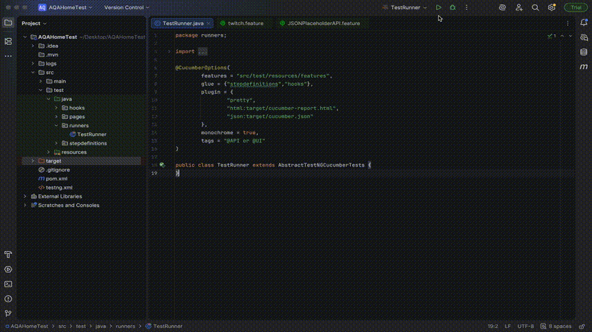

# Unified Automation Framework – API & UI

This repository implements a **unified automation framework** for API and UI testing using **Java, Cucumber, TestNG, REST Assured, and Selenium WebDriver**.It is designed for **parallel execution, reusability, and maintainability**, with the following features:

- **Thread-safe execution** using thread-confined singletons (`RequestFactory`,`DriverFactory`, `RuntimeStore`) for API requests and scenario data.  
- **Enum-based factories** (`JsonPayload`, `ResourceLinks`) and **abstract payloads** for centralized API request management.  
- **Dynamic runtime data injection** via `Injector` for flexible, scenario-specific payloads and paths.  
- **WebDriver management** via `DriverFactory` supporting multiple browsers with automated setup/teardown.  
- **Smart logging & reporting**:
  - Thread-specific API request/response logs (`logs/thread_x.log`)  
  - Log4j logging for detailed traceability  
  - Cucumber HTML/JSON reports with screenshots for UI failures  
- **Retry logic** for flaky tests, ensuring reliable execution.  
- **Configuration-driven execution** via `qa.properties`.  
- **Extensible architecture**, allowing new APIs, UI pages, and validations with minimal changes.  

**Outputs:**

- `target/cucumber-report.html` – consolidated scenario report with screenshots and logs  
- `target/cucumber.json` – JSON report for CI/CD integration  
- `logs/` – thread-specific API request/response logs  
- `screenshots/` – captured UI failures for debugging  

**GIF Demonstration:**

  

---

## Project Structure

```text
Logs
├── framework.log                     # General framework execution log
├── thread_x.log                      # Thread-specific API request/response logs

src/main/java
├── api
│   ├── enumtypes
│   │   ├── JsonPayload               # Enum-based factory for API request payloads
│   │   └── ResourceLinks             # Centralized API resource paths
│   ├── models
│   │   └── PostAPIPojo               # POJO representation for JSONPlaceholder POST API
│   └── payloads
│       ├── BasePayload               # Abstract base class handling request payloads
│       ├── Payload                   # Interface defining contract for all payloads
│       └── PostAPIValues             # Concrete payload with default values
├── utils
│   ├── DriverFactory                 # WebDriver management for UI automation
│   ├── ConfigManager                 # Configuration reader (qa.properties)
│   ├── ExtentManager                 # Extent report initialization and management
│   ├── Injector                      # Dynamic runtime data injection
│   ├── Listener                      # Custom TestNG/Cucumber listeners
│   ├── LogHelper                     # Centralized logging utility
│   ├── RequestFactory                # Thread-safe REST Assured request builder with logging
│   ├── Retry                         # Flaky test retry logic
│   ├── RuntimeStore                  # Thread-safe runtime memory storage
│   ├── Transform                     # Data transformation utility
│   └── Utils                         # Miscellaneous reusable utilities

src/main/resources
├── log4j.xml                          # Log4j logging configuration

src/test/java
├── hooks
│   ├── APIHooks                      # API test setup/teardown & scenario lifecycle
│   └── UIHooks                       # UI test setup/teardown
├── Pages
│   └── TwitchHomePage                # Page object model for Twitch homepage
├── runners
│   └── TestRunner                    # Cucumber TestNG runner
└── stepDefinitions
    ├── JSONPlaceholderStepDef        # Step definitions for JSONPlaceholder API
    └── TwitchSteps                   # Step definitions for Twitch UI

src/test/resources
├── features
│   ├── JSONPlaceholderAPI.feature    # JSONPlaceholder API scenarios
│   └── twitch.feature                # Twitch UI scenarios
├── schemas
│   └── PostListSchema.json           # JSON schema for response validation
├── assets
│   └── test_run.gif                  # GIF showing local test execution
└── qa.properties                      # Environment configuration

target
├── screenshots/                       # Captured screenshots for failures or checkpoints
│   ├── scenario_1.png
├── cucumber-report.html                # Consolidated scenario report with screenshots & logs
├── cucumber.json                       # JSON report for CI/CD or reporting tools

Testing.xml                              # TestNG suite configuration (parallel execution, threads, listeners)
